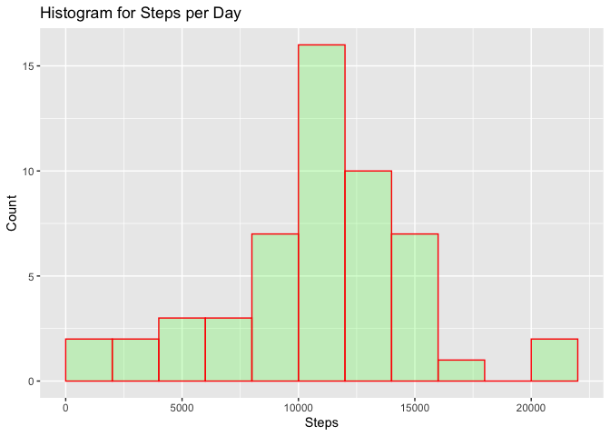
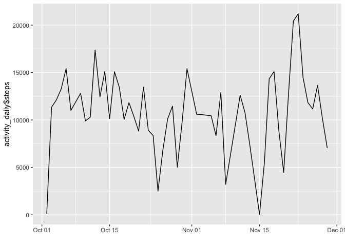
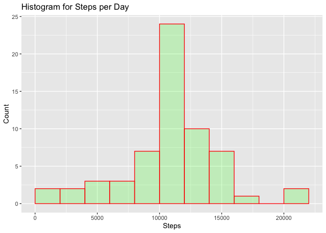
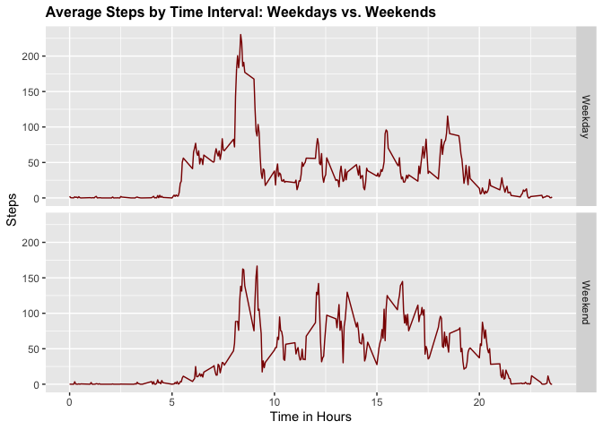

## Introduction

It is now possible to collect a large amount of data about personal movement using activity monitoring devices such as a Fitbit, Nike Fuelband, or Jawbone Up. These type of devices are part of the “quantified self” movement – a group of enthusiasts who take measurements about themselves regularly to improve their health, to find patterns in their behavior, or because they are tech geeks. But these data remain under-utilized both because the raw data are hard to obtain and there is a lack of statistical methods and software for processing and interpreting the data.

This assignment makes use of data from a personal activity monitoring device. This device collects data at 5 minute intervals through out the day. The data consists of two months of data from an anonymous individual collected during the months of October and November, 2012 and include the number of steps taken in 5 minute intervals each day.

The data for this assignment can be downloaded from the course web site:

* Dataset: [Activity monitoring data](https://d396qusza40orc.cloudfront.net/repdata%2Fdata%2Factivity.zip)  [52K]

This is an R Markdown document. Markdown is a simple formatting syntax for authoring HTML, PDF, and MS Word documents. For more details on using R Markdown see <http://rmarkdown.rstudio.com>.


The variables included in this dataset are:

* __steps:__ Number of steps taking in a 5-minute interval (missing values are coded as \color{red}{\verb|NA|}NA)
* __date:__ The date on which the measurement was taken in YYYY-MM-DD format
* __interval:__ Identifier for the 5-minute interval in which measurement was taken

The dataset is stored in a comma-separated-value (CSV) file and there are a total of 17,568 observations in this dataset.

## #1 Setting up the data

Let's begin by downloading and formatting the data


```r
#install.packages("tidyverse")
library(tidyverse)
#install.packages("lubridate")
library(lubridate)

fileUrl <- "https://d396qusza40orc.cloudfront.net/repdata%2Fdata%2Factivity.zip"
download.file(fileUrl, destfile = paste0(getwd(), '/repdata%2Fdata%2Factivity.zip'), method = "curl")
unzip("repdata%2Fdata%2Factivity.zip",exdir = "data")

activity <- read_csv("./data/activity.csv")
activity_daily <- activity %>% na.omit() %>% group_by(date) %>% summarize(steps = sum(steps)) 
```

## 

## #2 Including Plots

Let's look at a histogram of the total number of steps taken each day


```r
ggplot(activity_daily, aes(x = steps)) +  
  geom_histogram(breaks=seq(0, 23000, by=2000), col="red", fill="green", 
               alpha = .2) + 
  labs(title="Histogram for Steps per Day", x="Steps", y="Count") 
```

<!-- -->

## Descriptive Metrics

Note the Mean and Median number of steps taken each day.


```r
avg_daily_steps <- round(mean(activity_daily$steps), 2)
median_daily_steps <- median(activity_daily$steps)

avg_daily_steps
```

```
## [1] 10766.19
```

```r
median_daily_steps
```

```
## [1] 10765
```


And now let's look at a timeseries view of average daily steps


```r
p <- ggplot(activity_daily, type = l, aes(x=activity_daily$date, y = activity_daily$steps)) +
  geom_line() +
  xlab("")
p
```

<!-- -->

The 5-minute interval that, on average, contains the maximum number of steps is 835, with 206 steps.


```r
activity_int_mean <- activity %>% na.omit() %>% group_by(interval) %>% summarize(steps = mean(steps)) 
activity_int_mean
```

```
## # A tibble: 288 x 2
##    interval  steps
##       <dbl>  <dbl>
##  1        0 1.72  
##  2        5 0.340 
##  3       10 0.132 
##  4       15 0.151 
##  5       20 0.0755
##  6       25 2.09  
##  7       30 0.528 
##  8       35 0.868 
##  9       40 0     
## 10       45 1.47  
## # … with 278 more rows
```

```r
max_steps_int <- activity_int_mean[which.max(activity_int_mean$steps),]
max_steps_int
```

```
## # A tibble: 1 x 2
##   interval steps
##      <dbl> <dbl>
## 1      835  206.
```

## Imputation of Missing Values

Next we will want to develop a plan to address any missing values, of which there are many.  For rows where steps are missing, and contain NA, we will calculate the average value for that similar time interval, and insert this. Later we will see how this impacts the data set, by comparing it against the original data set with NA simply removed.


```r
#Step1 - determine how many values are missing

values_missing <- tbl_df(activity)
str(values_missing)
```

```
## Classes 'tbl_df', 'tbl' and 'data.frame':	17568 obs. of  3 variables:
##  $ steps   : num  NA NA NA NA NA NA NA NA NA NA ...
##  $ date    : Date, format: "2012-10-01" "2012-10-01" ...
##  $ interval: num  0 5 10 15 20 25 30 35 40 45 ...
##  - attr(*, "spec")=
##   .. cols(
##   ..   steps = col_double(),
##   ..   date = col_date(format = ""),
##   ..   interval = col_double()
##   .. )
```

```r
values_missing %>% filter(is.na(steps)) %>% summarize(missing_values = n())
```

```
## # A tibble: 1 x 1
##   missing_values
##            <int>
## 1           2304
```

```r
#Step2 - impute the missing values in a new column

activity$imputed_steps <- ifelse(is.na(activity$steps), round(activity_int_mean$steps[match(activity$interval, activity_int_mean$interval)],0), activity$steps)

activity2 <- data.frame(steps=activity$imputed_steps, interval=activity$interval, date=activity$date)

#calculate how many steps we imputed
sum(activity2$steps)-sum(activity$steps, na.rm = T)
```

```
## [1] 86096
```

```r
# Step 3 Calculate a histogram of this new imputed data
activity2_daily <- activity2 %>% na.omit() %>% group_by(date) %>% summarize(steps = sum(steps)) 

ggplot(activity2_daily, aes(x = steps)) +  
  geom_histogram(breaks=seq(0, 23000, by=2000), col="red", fill="green", 
                 alpha = .2) + 
  labs(title="Histogram for Steps per Day", x="Steps", y="Count") 
```

<!-- -->

```r
# Calculate the new mean and median values
avg2_daily_steps <- round(mean(activity2_daily$steps), 2)
median2_daily_steps <- median(activity2_daily$steps)

avg_daily_steps
```

```
## [1] 10766.19
```

```r
avg2_daily_steps
```

```
## [1] 10765.64
```

```r
median_daily_steps
```

```
## [1] 10765
```

```r
median2_daily_steps
```

```
## [1] 10762
```

Above we can see that imputing the values doesn't have a material effect on the mean or median values.  Further, comparing the histograms reveals that adding average values for missing values increases the central tendency, and only impacts the bin of values between 10,000 and 12,000.


# Comparing Weekends and Weekdays

Finally, let's look at the impact of the day type, and plot the differences. 


```r
activity3 <- activity2
activity3$weekday <- weekdays(activity3$date)

# create a new variable indicating weekday or weekend
activity3$day_type <- ifelse(activity3$weekday=='Saturday' | activity3$weekday=='Sunday', 'Weekend','Weekday')


# Create a plot to compare the Weekends and Weekdays
activity4 <- activity3 %>% mutate(interval = interval/100)
activity5 <- aggregate(steps~interval+day_type, data= activity4, FUN = mean, na.action=na.omit)


p1 <- ggplot(activity5, aes(interval, steps))
p1+geom_line(col="darkred")+ggtitle("Average Steps by Time Interval: Weekdays vs. Weekends")+xlab("Time in Hours")+ylab("Steps")+theme(plot.title = element_text(face="bold", size=12))+facet_grid(day_type ~ .)
```

<!-- -->

Intuitively, we see that there is more step activity during the mid day intervals during the Weekend.  One hypothesis is that more folks are at work during the Weekdays, and are stuck at their desks, limiting their step counts.

This concludes this project. Be well. 
